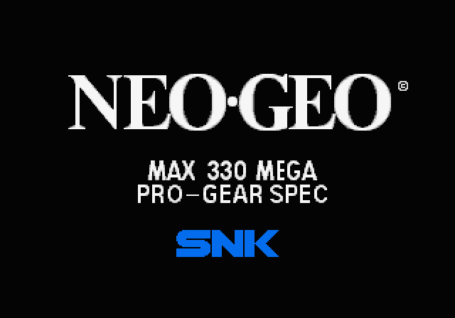
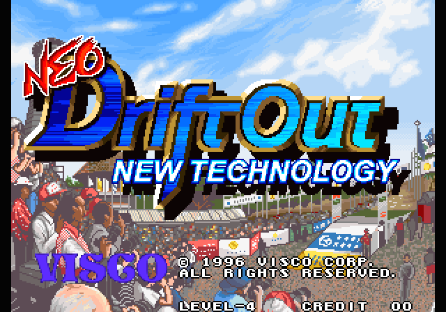
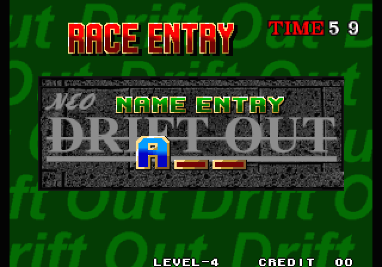
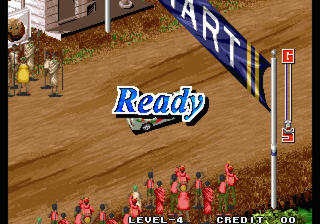
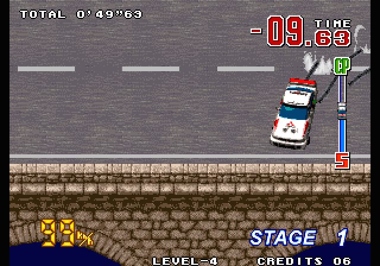
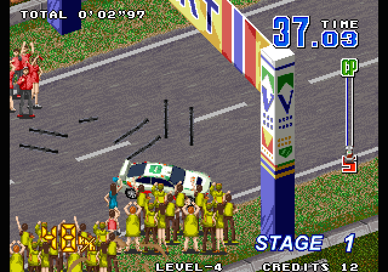

# Neo Drift Out: static recompilation

**Neo Drift Out: New Technology (Visco, 1996) running as a native PC program: its 68000 code is recompiled to C and runs on the [neogeorecomp](https://github.com/sp00nznet/neogeorecomp) board model.**

This repo describes the ROM set and builds the game. The toolkit does the rest, with no Drift Out-specific code in it.

> **No game data here.** You need your own Neo Drift Out and Neo Geo system ROM dumps (MAME sets `neodrift` and `neogeo`). The recompiled C is generated from your dump on your machine, into `build/`. It is never committed or distributed. (Earlier history of this repo contained ROMs and generated code; it was rewritten on 2026-09-29 to remove them.)

## Status

**v0.2.0-dev, alpha.** It boots, runs attract mode, takes a coin, and races on recompiled code. **There is no sound yet.**

- Boot through the real MVS system ROM → eyecatcher → car showcase → title → How to Play → name entry → practice and Stage 1.
- A 6-minute scripted soak runs **100% natively** (0 interpreted instructions) after the profile pass, and `--verify` checks **46.67M** recompiled blocks against the Musashi interpreter with **0 mismatches**.
- This is a port to the generic toolkit. The previous version was hand-lifted code plus a runtime patched for this one game (forced palettes, forced sprite shrink, BIOS state pokes), and it never got past the title with correct graphics. All of that is gone.
- Not yet: sound, later stages checked by script, and gamepad support.

## Screenshots

All real output from the recompiled build (`--headless --screenshot`):

| | |
|---|---|
|  |  |
|  |  |
|  |  |

## Getting started

### Quick start (Windows)

1. Download this repo: **Code → Download ZIP**, then unzip it. A `git clone` works too.
2. Put your **`neodrift.zip`** and **`neogeo.zip`** (MAME sets) in the unzipped folder, or in `Downloads`. Note that `driftout.zip` is Taito's *Drift Out*, a different game.
3. Double-click **`Setup.cmd`**.

   It checks for Git, CMake, the Visual Studio C++ build tools and SDL2, and asks before installing anything that's missing (it says what and how big). It finds and checksums your ROMs, recompiles and builds the game (a few minutes), and leaves a **Neo Drift Out** launcher in the folder. If something fails, it stops with one sentence on what to do and keeps the details in `setup.log`. Running it again picks up where it stopped.
4. Double-click **Neo Drift Out**.

**On Linux**, run `./setup.sh` instead, optionally with `--rom-zip PATH --bios-zip PATH`. When it finishes, run `./neodriftout.sh`.

Keys: **arrows** steer, **Z** accelerate, **X** brake, **5** insert coin, **1** start, **Esc** quit.

### Step by step

These are the commands `Setup.cmd` runs.

**Prerequisites:** Git; CMake 3.21+; a C compiler (Visual Studio 2022 with *Desktop development with C++* on Windows, or gcc on Linux); SDL2 for the window (optional, since headless builds need nothing). On Linux: `sudo apt install git cmake gcc libsdl2-dev`.

1. **Clone with the toolkit submodule:**
   ```
   git clone --recurse-submodules https://github.com/sp00nznet/neodriftout
   cd neodriftout
   ```
2. **Unzip your ROMs into `roms/`.** From `neodrift.zip`: `213-p1.p1 213-s1.s1 213-m1.m1 213-c1.c1 213-c2.c2 213-v1.v1 213-v2.v2`. From `neogeo.zip`: `sp-s2.sp1 sfix.sfix sm1.sm1 000-lo.lo`. [docs/game-notes.md](docs/game-notes.md) lists the CRC32s.
3. **Configure.** On Windows, point CMake at SDL2: vcpkg's toolchain file, or `-DSDL2_DIR=<SDL2-devel-VC>/cmake`.
   ```
   cmake -S . -B build -DNEODRIFT_ROM_DIR=roms
   ```
4. **Build.** The generator recompiles your ROMs into `build/generated` first:
   ```
   cmake --build build --config Release
   ```
   Expected in the output:
   ```
   [m68krecomp] pointer scan: 20705 seeds
   [m68krecomp] neodrift: 405519 instructions emitted across routines
   [m68krecomp] 21014 routines, 22910 dispatch entries -> .../build/generated
   ```
5. **Profile (optional).** This plays two scripted sessions headless to find code only reached at runtime, then rebuilds with it:
   ```
   cmake --build build --config Release --target profile
   cmake --build build --config Release
   ```
6. **Play:**
   ```
   build/Release/neodriftout --rom-path roms          (Linux: build/neodriftout)
   ```

Trip-ups:
- *`error: cannot open roms/213-p1.p1`*: the ROMs are not in `roms/`, or you are running from a different folder. Pass `--rom-path`.
- *"Submodules missing"*: you cloned without `--recurse-submodules`. Run `git submodule update --init --recursive`.
- *No window, and "built without SDL2; run with --headless"*: CMake didn't find SDL2 (see step 3).

## Usage

```
neodriftout --rom-path roms                                # play
neodriftout --headless --frames 5400 --input tests/coin_start.txt --record race.mp4
neodriftout --headless --verify --frames 5401 --input tests/coin_start.txt
```

The toolkit's [docs/running.md](https://github.com/sp00nznet/neogeorecomp/blob/master/docs/running.md) covers every option and the input-script format. `tests/coin_start.txt` reaches the practice race, and `tests/play_long.txt` is the 6-minute soak.

## Documentation

- [docs/game-notes.md](docs/game-notes.md): the ROM set and what the port showed
- [neogeorecomp](https://github.com/sp00nznet/neogeorecomp): the architecture and recompiler docs
- [CHANGELOG.md](CHANGELOG.md) · [ROADMAP.md](ROADMAP.md) · [CONTRIBUTING.md](CONTRIBUTING.md)

## Contributors

No outside contributions yet. [CONTRIBUTING.md](CONTRIBUTING.md) explains how to send one.

## License

The code in this repo is MIT ([LICENSE](LICENSE)). *Neo Drift Out* is © Visco; this project contains none of its code or data and needs your own dump to do anything.
